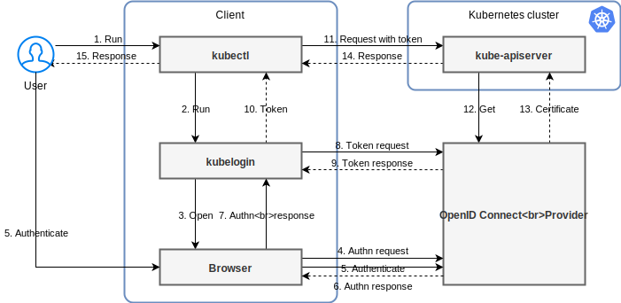

# kubelogin [](https://circleci.com/gh/int128/kubelogin)  [](https://goreportcard.com/report/github.com/int128/kubelogin)

This is a kubectl plugin for [Kubernetes OpenID Connect (OIDC) authentication](https://kubernetes.io/docs/reference/access-authn-authz/authentication/#openid-connect-tokens), also known as `kubectl oidc-login`.

Here is an example of Kubernetes authentication with the Google Identity Platform:


Kubelogin is designed to run as a [client-go credential plugin](https://kubernetes.io/docs/reference/access-authn-authz/authentication/#client-go-credential-plugins).
When you run kubectl, kubelogin opens the browser and you can log in to the provider.
Then kubelogin gets a token from the provider and kubectl access Kubernetes APIs with the token.
Take a look at the diagram:




## Getting Started

### Setup

Install the latest release from [Homebrew](https://brew.sh/), [Krew](https://github.com/kubernetes-sigs/krew) or [GitHub Releases](https://github.com/int128/kubelogin/releases) as follows:

```sh
# Homebrew
brew install int128/kubelogin/kubelogin

# Krew
kubectl krew install oidc-login

# GitHub Releases
curl -LO https://github.com/int128/kubelogin/releases/download/v1.16.0/kubelogin_linux_amd64.zip
unzip kubelogin_linux_amd64.zip
ln -s kubelogin kubectl-oidc_login

# Docker
docker run --rm quay.io/int128/kubelogin:v1.16.0
```

You need to set up the OIDC provider, cluster role binding, Kubernetes API server and kubeconfig.
The kubeconfig looks like:

```yaml
users:
- name: oidc
  user:
    exec:
      apiVersion: client.authentication.k8s.io/v1beta1
      command: kubectl
      args:
      - oidc-login
      - get-token
      - --oidc-issuer-url=ISSUER_URL
      - --oidc-client-id=YOUR_CLIENT_ID
      - --oidc-client-secret=YOUR_CLIENT_SECRET
```

See [the setup guide](docs/setup.md) for more.


### Run

Run kubectl.

```sh
kubectl get pods
```

Kubectl executes kubelogin before calling the Kubernetes APIs.
Kubelogin automatically opens the browser and you can log in to the provider.


After authentication, kubelogin returns the credentials to kubectl and finally kubectl calls the Kubernetes APIs with the credential.

```
% kubectl get pods
Open http://localhost:8000 for authentication
NAME                          READY   STATUS    RESTARTS   AGE
echoserver-86c78fdccd-nzmd5   1/1     Running   0          26d
```

Kubelogin writes the ID token and refresh token to the token cache file.

If the cached ID token is valid, kubelogin just returns it.
If the cached ID token has expired, kubelogin will refresh the token using the refresh token.
If the refresh token has expired, kubelogin will perform reauthentication.


### Troubleshoot

You can log out by removing the token cache directory (default `~/.kube/cache/oidc-login`).
Kubelogin will perform authentication if the token cache file does not exist.

You can dump the claims of token by passing `-v1` option.

```
I1212 10:14:17.754394    2517 get_token.go:91] the ID token has the claim: sub=********
I1212 10:14:17.754434    2517 get_token.go:91] the ID token has the claim: at_hash=********
I1212 10:14:17.754449    2517 get_token.go:91] the ID token has the claim: nonce=********
I1212 10:14:17.754459    2517 get_token.go:91] the ID token has the claim: iat=1576113256
I1212 10:14:17.754467    2517 get_token.go:91] the ID token has the claim: exp=1576116856
I1212 10:14:17.754484    2517 get_token.go:91] the ID token has the claim: iss=https://accounts.google.com
I1212 10:14:17.754497    2517 get_token.go:91] the ID token has the claim: azp=********.apps.googleusercontent.com
I1212 10:14:17.754506    2517 get_token.go:91] the ID token has the claim: aud=********.apps.googleusercontent.com
```


## Usage

This document is for the development version.
If you are looking for a specific version, see [the release tags](https://github.com/int128/kubelogin/tags).

Kubelogin supports the following options:

```
Usage:
  kubelogin get-token [flags]

Flags:
      --oidc-issuer-url string              Issuer URL of the provider (mandatory)
      --oidc-client-id string               Client ID of the provider (mandatory)
      --oidc-client-secret string           Client secret of the provider
      --oidc-extra-scope strings            Scopes to request to the provider
      --certificate-authority string        Path to a cert file for the certificate authority
      --certificate-authority-data string   Base64 encoded data for the certificate authority
      --insecure-skip-tls-verify            If true, the server's certificate will not be checked for validity. This will make your HTTPS connections insecure
      --token-cache-dir string              Path to a directory for caching tokens (default "~/.kube/cache/oidc-login")
      --grant-type string                   The authorization grant type to use. One of (auto|authcode|authcode-keyboard|password) (default "auto")
      --listen-address strings              Address to bind to the local server. If multiple addresses are given, it will try binding in order (default [127.0.0.1:8000,127.0.0.1:18000])
      --listen-port ints                    (Deprecated: use --listen-address)
      --skip-open-browser                   If true, it does not open the browser on authentication
      --username string                     If set, perform the resource owner password credentials grant
      --password string                     If set, use the password instead of asking it
  -h, --help                                help for get-token

Global Flags:
      --add_dir_header                   If true, adds the file directory to the header
      --alsologtostderr                  log to standard error as well as files
      --log_backtrace_at traceLocation   when logging hits line file:N, emit a stack trace (default :0)
      --log_dir string                   If non-empty, write log files in this directory
      --log_file string                  If non-empty, use this log file
      --log_file_max_size uint           Defines the maximum size a log file can grow to. Unit is megabytes. If the value is 0, the maximum file size is unlimited. (default 1800)
      --logtostderr                      log to standard error instead of files (default true)
      --skip_headers                     If true, avoid header prefixes in the log messages
      --skip_log_headers                 If true, avoid headers when opening log files
      --stderrthreshold severity         logs at or above this threshold go to stderr (default 2)
  -v, --v Level                          number for the log level verbosity
      --vmodule moduleSpec               comma-separated list of pattern=N settings for file-filtered logging
```

See also the options of [standalone mode](docs/standalone-mode.md).

### Extra scopes

You can set the extra scopes to request to the provider by `--oidc-extra-scope`.

```yaml
      - --oidc-extra-scope=email
      - --oidc-extra-scope=profile
```

### CA Certificate

You can use your self-signed certificate for the provider.

```yaml
      - --certificate-authority=/home/user/.kube/keycloak-ca.pem
      - --certificate-authority-data=LS0t...
```

### HTTP Proxy

You can set the following environment variables if you are behind a proxy: `HTTP_PROXY`, `HTTPS_PROXY` and `NO_PROXY`.
See also [net/http#ProxyFromEnvironment](https://golang.org/pkg/net/http/#ProxyFromEnvironment).

### Docker

You can run [the Docker image](https://quay.io/repository/int128/kubelogin) instead of the binary.
The kubeconfig looks like:

```yaml
users:
- name: oidc
  user:
    exec:
      apiVersion: client.authentication.k8s.io/v1beta1
      command: docker
      args:
      - run
      - --rm
      - -v
      - /tmp/.token-cache:/.token-cache
      - -p
      - 8000:8000
      - quay.io/int128/kubelogin:v1.16.0
      - get-token
      - --token-cache-dir=/.token-cache
      - --listen-address=0.0.0.0:8000
      - --oidc-issuer-url=ISSUER_URL
      - --oidc-client-id=YOUR_CLIENT_ID
      - --oidc-client-secret=YOUR_CLIENT_SECRET
```

Known limitations:

- It cannot open the browser automatically.
- The container port and listen port must be equal for consistency of the redirect URI.

### Authentication flows

#### Authorization code flow

Kubelogin performs the authorization code flow by default.

It starts the local server at port 8000 or 18000 by default.
You need to register the following redirect URIs to the provider:

- `http://localhost:8000`
- `http://localhost:18000` (used if port 8000 is already in use)

You can change the listening address.

```yaml
      - --listen-address=127.0.0.1:12345
      - --listen-address=127.0.0.1:23456
```

#### Authorization code flow with keyboard interactive

If you cannot access the browser, instead use the authorization code flow with keyboard interactive.

```yaml
      - --grant-type=authcode-keyboard
```

Kubelogin will show the URL and prompt.
Open the URL in the browser and then copy the code shown.

```
% kubectl get pods
Open https://accounts.google.com/o/oauth2/v2/auth?access_type=offline&client_id=...
Enter code: YOUR_CODE
```

Note that this flow uses the redirect URI `urn:ietf:wg:oauth:2.0:oob` and
some OIDC providers do not support it.

#### Resource owner password credentials grant flow

Kubelogin performs the resource owner password credentials grant flow
when `--grant-type=password` or `--username` is set.

Note that most OIDC providers do not support this flow.
Keycloak supports this flow but you need to explicitly enable the "Direct Access Grants" feature in the client settings.

You can set the username and password.

```yaml
      - --username=USERNAME
      - --password=PASSWORD
```

If the password is not set, kubelogin will show the prompt for the password.

```yaml
      - --username=USERNAME
```

```
% kubectl get pods
Password:
```

If the username is not set, kubelogin will show the prompt for the username and password.

```yaml
      - --grant-type=password
```

```
% kubectl get pods
Username: foo
Password:
```


## Related works

### Kubernetes Dashboard

You can access the Kubernetes Dashboard using kubelogin and [kauthproxy](https://github.com/int128/kauthproxy).


## Contributions

This is an open source software licensed under Apache License 2.0.
Feel free to open issues and pull requests for improving code and documents.

### Development

Go 1.13 or later is required.

```sh
# Run lint and tests
make check

# Compile and run the command
make
./kubelogin
```

See also [the acceptance test](acceptance_test).
