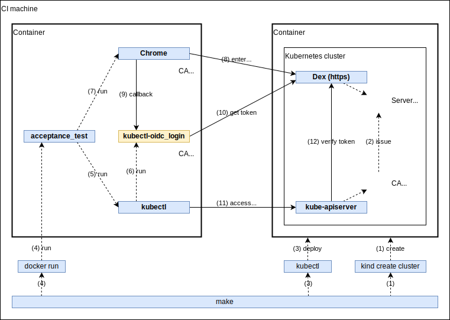

# kubelogin/acceptance_test

This is an acceptance test to verify behavior of kubelogin using a real Kubernetes cluster and OpenID Connect provider.
It runs on [GitHub Actions](https://github.com/int128/kubelogin/actions?query=workflow%3Aacceptance-test).

Let's take a look at the diagram.



It prepares the following resources:

1. Generate a pair of CA certificate and TLS server certificate for Dex.
1. Run Dex on a container.
1. Create a Kubernetes cluster using Kind.
1. Mutate `/etc/hosts` of the CI machine to access Dex.
1. Mutate `/etc/hosts` of the kube-apiserver pod to access Dex.

It performs the test by the following steps:

1. Run kubectl.
1. kubectl automatically runs kubelogin.
1. Open the browser and navigate to `http://localhost:8000`.
1. Enter the username and password on the browser.
1. kubelogin gets an authorization code from the browser.
1. kubelogin gets a token.
1. kubectl accesses an API with the token.
1. kube-apiserver verifies the token by Dex.
1. Check if kubectl exited with code 0.


## Technical consideration

### Network and DNS

Consider the following issues:

- kube-apiserver runs on the host network of the kind container.
- kube-apiserver cannot resolve a service name by kube-dns.
- kube-apiserver cannot access a cluster IP.
- kube-apiserver can access another container via the Docker network.
- Chrome requires exactly match of domain name between Dex URL and a server certificate.

Consequently,

- kube-apiserver accesses Dex by resolving `/etc/hosts` and via the Docker network.
- kubelogin and Chrome accesses Dex by resolving `/etc/hosts` and via the Docker network.

### TLS server certificate

Consider the following issues:

- kube-apiserver requires `--oidc-issuer` is HTTPS URL.
- kube-apiserver requires a CA certificate at startup, if `--oidc-ca-file` is given.
- kube-apiserver mounts `/usr/local/share/ca-certificates` from the kind container.
- It is possible to mount a file from the CI machine.
- It is not possible to issue a certificate using Let's Encrypt in runtime.
- Chrome requires a valid certificate in `~/.pki/nssdb`.

As a result,

- kube-apiserver uses the CA certificate of `/usr/local/share/ca-certificates/dex-ca.crt`. See the `extraMounts` section of [`cluster.yaml`](cluster.yaml).
- kubelogin uses the CA certificate in `output/ca.crt`.
- Chrome uses the CA certificate in `~/.pki/nssdb`.

### Test environment

- Set the issuer URL to kubectl. See [`kubeconfig_oidc.yaml`](kubeconfig_oidc.yaml).
- Set the issuer URL to kube-apiserver. See [`cluster.yaml`](cluster.yaml).

### Test scenario

- Run `kubectl` and open the browser concurrently.
- It need to wait until `http://localhost:8000` is available. It prevents the browser error.
- It need to kill sub-processes finally, i.e. kubectl and kubelogin.


## Run locally

You need to set up Docker and Kind.

You need to add the following line to `/etc/hosts`:

```
127.0.0.1 dex-server
```

Run:

```shell script
# run the test
make

# clean up
make delete-cluster
make delete-dex
```
