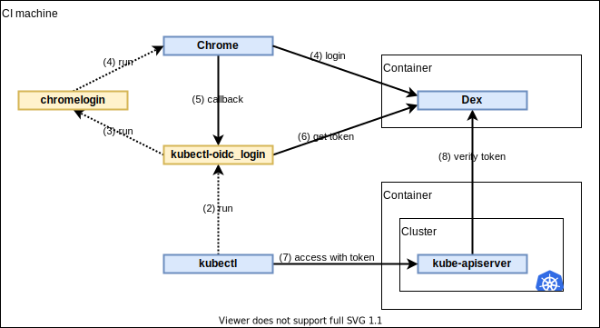

# kubelogin/acceptance_test

This is an acceptance test to verify behavior of kubelogin using a real Kubernetes cluster and OpenID Connect provider.
It runs on [GitHub Actions](https://github.com/int128/kubelogin/actions?query=workflow%3Aacceptance-test).

Let's look at the diagram.



It performs the test by the following steps:

1. Create a Kubernetes cluster using Kind.
1. Generate a TLS server certificate for Dex.
1. Deploy Dex and the cluster role to the cluster.
1. Run the test in a container.
1. Run kubectl.
1. kubectl automatically runs kubelogin.
1. Open the browser and navigate to `http://localhost:8000`.
1. Enter the username and password on the browser.
1. kubelogin gets an authorization code from the browser.
1. kubelogin gets a token.
1. kubectl accesses an API with the token.
1. kube-apiserver verifies the token by Dex.
1. Check if kubectl exited with code 0.


## Technical consideration

### Network and DNS

Consider the following issues:

- kube-apiserver runs on the host network.
- kube-apiserver cannot resolve a service name by kube-dns, e.g. `server.dex.svc.cluster.local`.
- kube-apiserver cannot access a cluster IP.
- Chromium requires exactly match of domain name between Dex URL and a server certificate.

kube-apiserver accesses Dex via the following route:

```
kube-apiserver
↓
kind-control-plane:30443 (host port)
↓
dex-service:30443 (node port)
↓
dex-pod-container:30443 (pod container port)
```

### TLS server certificate

Consider the following issues:

- kube-apiserver requires `--oidc-issuer` is HTTPS URL.
- kube-apiserver requires a CA certificate at startup, if `--oidc-ca-file` is given.
- kube-apiserver has a CA key pair at `/etc/kubernetes/pki`.
- It is not possible to put a file into kube-apiserver at startup.
- It is not possible to issue a certificate using Let's Encrypt in runtime.
- Chromium requires a valid certificate in the NSS database.

In the test, it gets the CA certificate from the kind container, generates a server certificate and puts it into the test container.
As a result,

- Dex uses the server certificate for serving TLS connection.
- kube-apiserver uses the CA certificate for verifying TLS connection.
- kubelogin uses the CA certificate for verifying TLS connection.
- Chromium uses the CA certificate for verifying TLS connection.

### Test environment

- Set the issuer URL to kubectl (see [`kubeconfig.yaml`](kubeconfig.yaml)) and kube-apiserver (see [`cluster.yaml`](cluster.yaml)).
- Create a cluster role which has read-only access (see [`role.yaml`](role.yaml)).
- Install Chromium in the test container.
- Change `/etc/hosts` to access Dex from the test container, by using `--add-host` flag of Docker.

### Test scenario

- Run `kubectl` and open the browser concurrently.
- It need to wait until `http://localhost:8000` is available. It prevents the browser error.
- It need to kill sub-processes finally, i.e. kubectl and kubelogin.


## Run locally

You need to set up Docker and Kind.

```shell script
# run the test
make

# clean up
make delete-cluster
```
