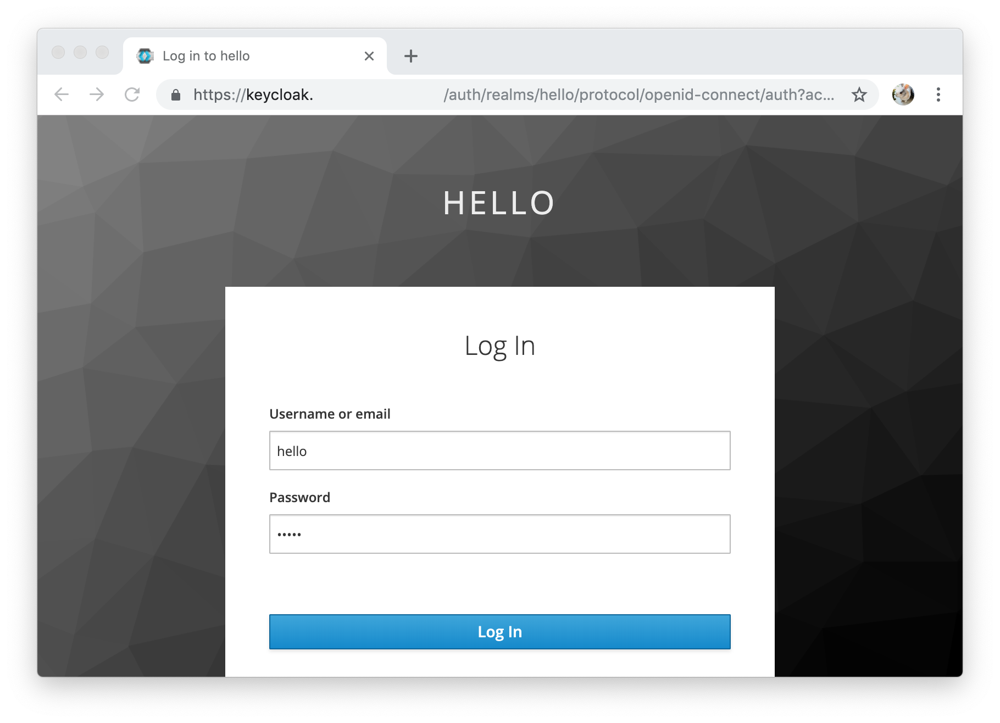

# Standalone mode

Kubelogin supports the standalone mode as well.
It writes the token to the kubeconfig (typically `~/.kube/config`) after authentication.


## Getting started

Configure your kubeconfig like:

```yaml
- name: keycloak
  user:
    auth-provider:
      config:
        client-id: YOUR_CLIENT_ID
        client-secret: YOUR_CLIENT_SECRET
        idp-issuer-url: https://issuer.example.com
      name: oidc
```

Run kubelogin:

```sh
kubelogin

# or run as a kubectl plugin
kubectl oidc-login
```

It automatically opens the browser and you can log in to the provider.



After authentication, kubelogin writes the ID token and refresh token to the kubeconfig.

```console
% kubelogin
Open http://localhost:8000 for authentication
You got a valid token until 2019-05-18 10:28:51 +0900 JST
Updated ~/.kubeconfig
```

Now you can access the cluster.

```console
% kubectl get pods
NAME                          READY   STATUS    RESTARTS   AGE
echoserver-86c78fdccd-nzmd5   1/1     Running   0          26d
```

Your kubeconfig looks like:

```yaml
users:
- name: keycloak
  user:
    auth-provider:
      config:
        client-id: YOUR_CLIENT_ID
        client-secret: YOUR_CLIENT_SECRET
        idp-issuer-url: https://issuer.example.com
        id-token: ey...       # kubelogin will add or update the ID token here
        refresh-token: ey...  # kubelogin will add or update the refresh token here
      name: oidc
```

If the ID token is valid, kubelogin does nothing.

```console
% kubelogin
You already have a valid token until 2019-05-18 10:28:51 +0900 JST
```

If the ID token has expired, kubelogin will refresh the token using the refresh token in the kubeconfig.
If the refresh token has expired, kubelogin will proceed the authentication.


## Usage

You can set path to the kubeconfig file by the option or the environment variable just like kubectl.
It defaults to `~/.kube/config`.

```sh
# by the option
kubelogin --kubeconfig /path/to/kubeconfig

# by the environment variable
KUBECONFIG="/path/to/kubeconfig1:/path/to/kubeconfig2" kubelogin
```

If you set multiple files, kubelogin will find the file which has the current authentication (i.e. `user` and `auth-provider`) and write a token to it.

Kubelogin supports the following keys of `auth-provider` in a kubeconfig.
See [kubectl authentication](https://kubernetes.io/docs/reference/access-authn-authz/authentication/#using-kubectl) for more.

Key | Direction | Value
----|-----------|------
`idp-issuer-url`                  | Read (Mandatory) | Issuer URL of the provider.
`client-id`                       | Read (Mandatory) | Client ID of the provider.
`client-secret`                   | Read (Mandatory) | Client Secret of the provider.
`idp-certificate-authority`       | Read | CA certificate path of the provider.
`idp-certificate-authority-data`  | Read | Base64 encoded CA certificate of the provider.
`extra-scopes`                    | Read | Scopes to request to the provider (comma separated).
`id-token`                        | Write | ID token got from the provider.
`refresh-token`                   | Write | Refresh token got from the provider.

See also [usage.md](usage.md).
