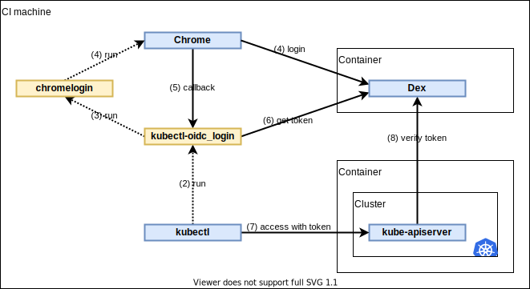

# kubelogin/system_test

This is an automated test for verifying behavior of the plugin with a real Kubernetes cluster and OIDC provider.


## Purpose

This test checks the following points:

1. User can set up Kubernetes OIDC authentication using [setup guide](../docs/setup.md).
1. User can log in to an OIDC provider on a browser.
1. User can access the cluster using a token returned from the plugin.

It depends on the following components:

- Kubernetes cluster (Kind)
- OIDC provider (Dex)
- Browser (Chrome)
- kubectl command


## How it works

Let's take a look at the diagram.



It prepares the following resources:

1. Generate a pair of CA certificate and TLS server certificate for Dex.
1. Run Dex on a container.
1. Create a Kubernetes cluster using Kind.
1. Mutate `/etc/hosts` of the machine so that the browser access Dex.
1. Mutate `/etc/hosts` of the kind container so that kube-apiserver access Dex.

It performs the test by the following steps:

1. Run kubectl.
1. kubectl automatically runs kubelogin.
1. kubelogin automatically runs [chromelogin](login/chromelogin).
1. chromelogin opens the browser, navigates to `http://localhost:8000` and enter the username and password.
1. kubelogin gets an authorization code from the browser.
1. kubelogin gets a token.
1. kubectl accesses an API with the token.
1. kube-apiserver verifies the token by Dex.
1. Check if kubectl exited with code 0.


## Run locally

You need to set up the following components:

- Docker
- Kind
- Chrome or Chromium

Add the following line to `/etc/hosts` so that the browser can access the Dex.

```
127.0.0.1 dex-server
```

Generate CA certificate and add `cert/ca.crt` into your trust store.
For macOS, you can add it by Keychain.

```shell script
make -C cert
```

Run the test.

```shell script
make
```

Clean up.

```shell script
make terminate
make clean
```


## Technical consideration

### Network and DNS

Consider the following issues:

- kube-apiserver runs on the host network of the kind container.
- kube-apiserver cannot resolve a service name by kube-dns.
- kube-apiserver cannot access a cluster IP.
- kube-apiserver can access another container via the Docker network.
- Chrome requires exactly match of domain name between Dex URL and a server certificate.

Consequently,

- kube-apiserver accesses Dex by resolving `/etc/hosts` and via the Docker network.
- kubelogin and Chrome accesses Dex by resolving `/etc/hosts` and via the Docker network.

### TLS server certificate

Consider the following issues:

- kube-apiserver requires `--oidc-issuer` is HTTPS URL.
- kube-apiserver requires a CA certificate at startup, if `--oidc-ca-file` is given.
- kube-apiserver mounts `/usr/local/share/ca-certificates` from the kind container.
- It is possible to mount a file from the CI machine.
- It is not possible to issue a certificate using Let's Encrypt in runtime.
- Chrome requires a valid certificate in `~/.pki/nssdb`.

As a result,

- kube-apiserver uses the CA certificate of `/usr/local/share/ca-certificates/dex-ca.crt`. See the `extraMounts` section of [`cluster.yaml`](cluster/cluster.yaml).
- kubelogin uses the CA certificate in `output/ca.crt`.
- Chrome uses the CA certificate in `~/.pki/nssdb`.

### Test environment

- Set the issuer URL to kube-apiserver. See [`cluster.yaml`](cluster/cluster.yaml).
- Set `BROWSER` environment variable to run [`chromelogin`](login/chromelogin) by `xdg-open`.
